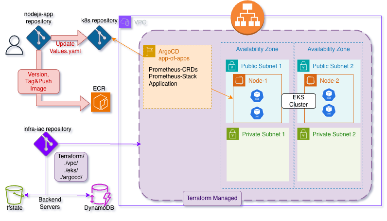

# terraform-iac

This repository contains the Infrastructure-as-Code (IaC) required to provision the cloud foundation for the Node.js application ecosystem. It uses Terraform to manage AWS resources including VPC networking, EKS clusters, and IAM permissions.

## Project Ecosystem

This project provides the base layer for a **3-repository GitOps architecture**:

1.  **[Application Repo (sample-nodejs-app)](https://github.com/liormilliger/sample-nodejs-app.git)**: Source code and CI pipeline.
2.  **[GitOps Repo (node-js-sample-k8s)](https://github.com/liormilliger/node-js-sample-k8s.git)**: Helm charts and ArgoCD manifests.
3.  **Infrastructure Repo (This one)**: Terraform modules for the AWS foundation.

### System Architecture


---

## Prerequisites

Before deploying the infrastructure, you must manually create the S3 backend and DynamoDB lock table to manage the Terraform state:

### 1. Create DynamoDB State Lock Table
```
aws dynamodb create-table \
  --table-name {TABLE_NAME} \
  --attribute-definitions AttributeName=LockID,AttributeType=S \
  --key-schema AttributeName=LockID,KeyType=HASH \
  --billing-mode PAY_PER_REQUEST \
  --region {REGION}
```

### 2. Create S3 Backend Bucket
Ensure an S3 bucket is created in your account to store the `.tfstate` files securely.

### 3. Create ECR Repository
Create an Amazon Elastic Container Registry (ECR) to host the application Docker images.

### 4. Fill the mock-terraform.tfvars
Fill in the missing details according to instruction and change the file name to terraform.tfvars

---

## Deployment Instructions
Deploy the modules sequentially to ensure proper dependency management:

### Initialize terraform

```
terraform init
```

### Provision Infrastructure Modules
```
terraform apply --auto-approve --target module.vpc
terraform apply --auto-approve --target module.eks
terraform apply --auto-approve --target module.argocd
```
---

## Access ArgoCD
Once the ArgoCD module is deployed, retrieve the initial admin password:

```
kubectl -n argocd get secret argocd-initial-admin-secret -o jsonpath="{.data.password}" | base64 --decode && echo
```

Port-forward the ArgoCD server to access the UI locally:

```
kubectl port-forward svc/argocd-server -n argocd 8082:443
```

* **URL**: https://localhost:8082

* **Username**: admin

---

## Access Monitoring (Grafana)
After the monitoring stack is synchronized via ArgoCD, port-forward Grafana:

```
kubectl port-forward svc/prometheus-stack-grafana 8085:80 -n monitoring
```

* **URL**: http://localhost:8085

* **Credentials**: admin / prom-operator

---

## Access the Application
Once the deployment is synchronized in ArgoCD, the Node.js application is exposed via an AWS Network Load Balancer (NLB).

### Retrieve Load Balancer DNS
Run the following command to get the external DNS name of your service:
```
kubectl get svc nodejs-app -n nodejs-app -o jsonpath='{.status.loadBalancer.ingress[0].hostname}'
```

### Access the Endpoint
Open your browser and navigate to the application path:

* **URL**: http://load-balancer-dns/my-app

* **Metrics**: http://load-balancer-dns/metrics

Note: It may take a few minutes for the AWS Load Balancer to finish provisioning and for the DNS to propagate. If you cannot reach the URL immediately, check the target group health in the AWS Console.
